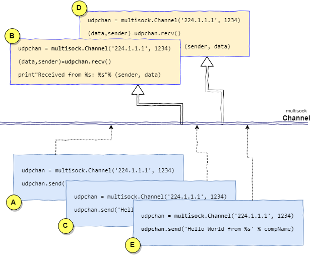

Python lib for multicasting
============================

# Motivations

```
A sample with 2 Readers B,D and 3 Writer A,C,E.
```



The idea behind this project is to provide a compact and easy to use library for allowinf
components to communicate on a multicast channel (often referred to as multicast group).

In the diagram above there are 2 readers and 3 writers that are unaware of each other.
Once A sends a message, all the listening components (e.g. B,D) are able to
receive it and properly act autonomously.

Components can dynamically connect/disconnect to this channel for both sending and receiving
messages on it.


## Cons


- *no reliability*: there is no guarantee that the messages sent would reach all listening components or can
happen they are delivered unordered.
- *no consistency*: some packets can get lost and there is no queue system in the middle to ensure they will
eventually be resent to the targets.


## Pros

The cons reported above essentially mean:
- no queues
- no intermediate services
- no idea where packets are sent

No special resources needed and can easily run on raspberry or similar low budget computers to implement
interactions on your LAN.

A sample of what you can do with this:
- a local network of small controllers for managing IoT sensors (it's my case).
Consider you have an hub requiring to put "all lights off".
The only constraint is: *it must be done now*.
No matter so if the controllers that loose this instruction will be able to handle it in some minutes.
Namely, persistente and reliability is not relevant in this environment.


# Core concepts

## Channel

***Channel***
An udp multicasting channel on wich components can both read and write data.
A channel is essentially represented by a tuple (multicast_ip, port).


#### Customizing logger
By default logger is configured to simply show messages on STDOUT.
If you prefer to trace messages on a file this is the shortest way.

```python
import multisock
from multisock import LogFactory

# This will create a logger associated to a component named <mycomponent> and will log output into a file
# <traces>_$date.log. Notice that the second parameter is optional (the filename) and if None or not passed
# the logger will simply trace info on STDOUT.
mylogger=LogFactory('mycomponent', 'traces')
mylogger.info('Hello world!')
mylogger.warn('Too lazy to check logging APIs. Maybe later!')
mylogger.critical('This should never happen')
mylogger.fatal('Farewell cruel world')
```

#### Connecting to a channel
```python
import multisock
# My logger is optional parameter in case you want to log on a file
udpchan = multisock.Channel('224.1.1.1', 1234, mylogger)
```

#### Sending messages on the channel
```python
udpchan.send('Hello World')
```


#### Receiving data from the channel
```python
(data,sender)=udpchan.recv()
print "Received from %s: %s" % (sender, data)
```

## Installation

#### Requirements

> Python 3.x
> PyCrypto (for windows use `pip install pycryptodome`)

#### Get sources from git

```
git clone https://github.com/strollo/multisock
```

#### Install

Check required libs are installed.

```
pip install -r requirements.txt
```

Install this lib

```
python setup.py install
```

## Encryption

From the 1.0.2 version it has been added support for encrypting exchanged data via [PyCrypto](https://pypi.org/project/pycrypto/) library.

#### Usage

The channel can now be instantiated by specifying a DataCrypto instance that will receive two strings (key, passphrase) to apply the encryption/decryption.

```python
from multisock import DataCrypto
udpchan = multisock.Channel('224.1.1.1', 1234, crypto=DataCrypto('key', 'passphrase'))
```

## Authors

* **Daniele Strollo** - *Initial work* - [MultiSock](https://github.com/strollo/multisock)

## License

This project is licensed under the Apache 2.0 License - see the [LICENSE](LICENSE) file for details
